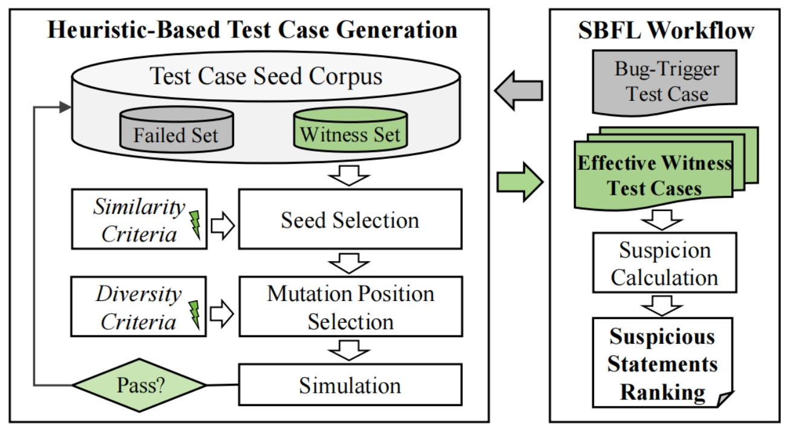

# Wit-HW: Bug Localization in Hardware Design Code via Witness Test Case Generation

This repository contains the source code for the paper "Wit-HW: Bug Localization in Hardware Design Code via Witness Test Case Generation" (ICCAD'25).

## Overview

Wit-HW is a novel approach for bug localization in hardware design code. It addresses the challenge of identifying bug locations in complex hardware designs by generating targeted witness test cases that help isolate faulty components.

### The Problem
Debugging hardware designs is time-consuming and challenging due to:
- Increasing design complexity
- Limited observability during execution
- Difficulty in creating test cases that trigger specific bugs

### Our Approach
Wit-HW employs a three-stage methodology:
1. **Initial Simulation**: Runs initial test cases to identify behavioral differences between buggy and correct designs
2. **Mutation Engine**: Generates targeted witness test cases that maximize bug-revealing potential
3. **Bug Localization**: Computes suspiciousness scores for design elements using coverage data from witness test cases




## Prerequisites

- Python >= 3.11
- Verilator >= 5.027


## Usage

### Running Wit-HW

```bash
python withw/run.py
```

### Running Tarsel (Baseline)

```bash
python tarsel/run.py
```

### Example Buggy Designs

The `buggy_designs` directory contains several buggy hardware designs. Each design has a corresponding `bug-info.json` file that describes the bug.

## Citation

We would appreciate it if you cite our paper when using Wit-HW in your research:

```bibtex
@inproceedings{
  title={Wit-HW: Bug Localization in Hardware Design Code via Witness Test Case Generation},
  author={Ruiyang Ma, Daikang Kuang, Ziqian Liu, Jiaxi Zhang, Ping Fan, Guojie Luo},
  booktitle={2025 International Conference on Computer-Aided Design (ICCAD)},
  year={2025}
}
```
